# Rendu SAE image
## GRANDCHAMP Loris

#### A0 ) 
42 et 4D correspondent respectivement à B et M en ASCII en hexadécimal. Les 4 octets suivants correspondent à la taille du fichier. Ensuite 4 octets de 0. Et ensuite l’adresse où commence le tableau de pixels de l’image (ici 00 00 00 1A).
Pour régler l’erreur j’ai (avec l’aide d’un camarade) regardé la taille du fichier en allant tout en bas du fichier sur Okteta et l’adresse me donnait la taille.

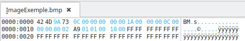

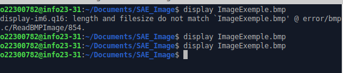

### A1 ) 
J’ai créé mon fichier selon les directives mais j’ai cru que le blanc n’était que des 0 sauf que non donc mon image était erronée :

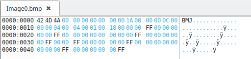
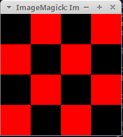

Voici la bonne version après correction :

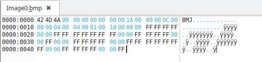

### A2 )
Grâce à la documentation fournie j’ai pu généré mon damier correctement :

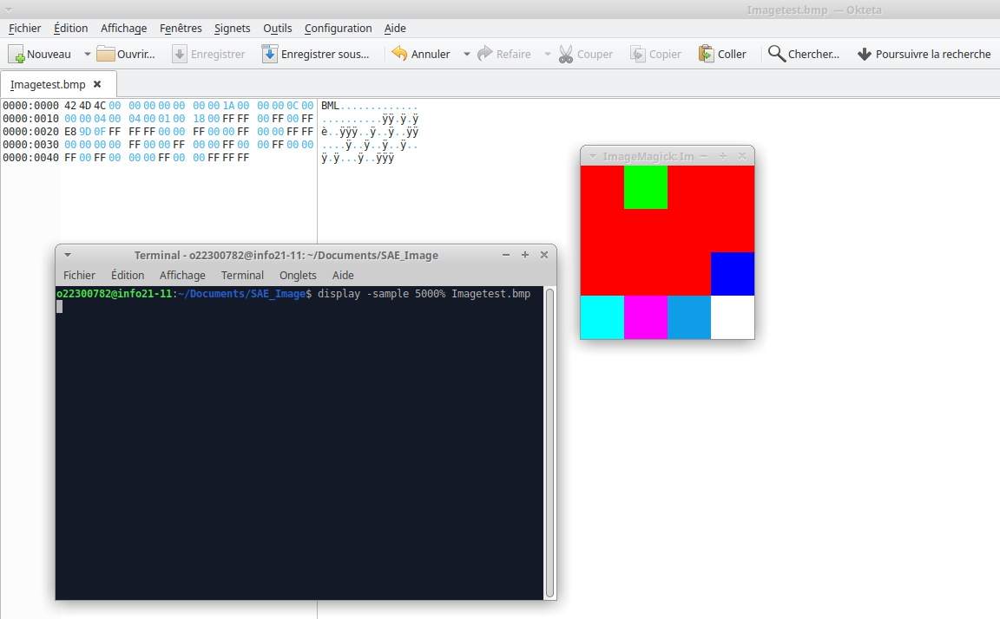

### A3 )
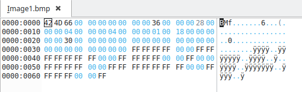

#### 1 ) 
24 (3*8 car 3 octets par pixels).

#### 2 ) 
48 octets (je compte les octets entre la position 36 et la position 66).

#### 3 ) 
Il n’y en a pas, le bit à l’emplacement 1E est de zéro donc il n’y a pas de compression.

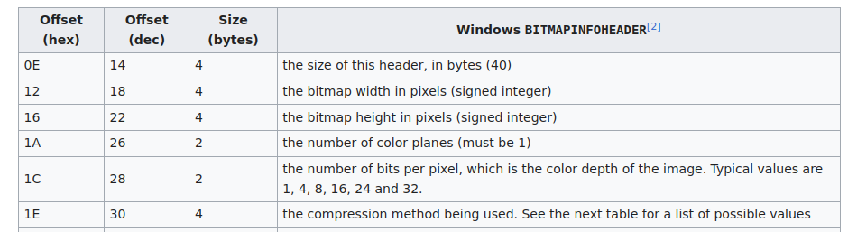

#### 4 )
Non, le codage n’a pas été changé.

### A4 ) 
#### 1 ) 
Dans la palette il y a 2 couleurs donc le bit est soit 0 soit 1 donc il y a 1 bit par pixel.

#### 2 ) 
16 octets (je compte les octets entre la position 3E et la position 4E).

#### 3 ) 
Comme dans la A3) 3) je regarde à la position 1E, il y a 0 bit donc il n’y a pas de compression.

#### 4 ) 
Les couleurs sont codées sur 4 octets RGBA mais nous sommes en little endian donc c’est en BGRA.

#### 5 ) 
2 car nous l’avons spécifié à la conversion du ficher « convert Image1.bmp -colors 2 bmp3:Image2.bmp »

#### 6 ) 
Oui car les pixels sont passés d’un codage sur 3 octet à un codage 1 bit.

#### 7 ) 
J’ai changé la première couleur de la palette à l’adresse 36.

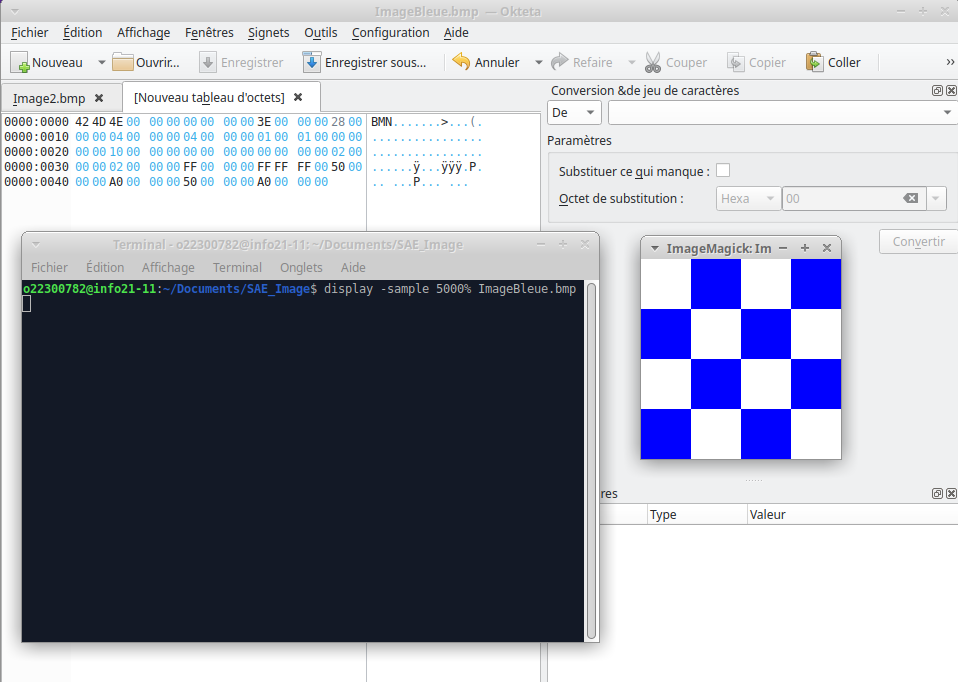

#### 8 ) 
Pareil qu’à la 7), j’ai changé les couleurs de la palette à l’adresse 36.

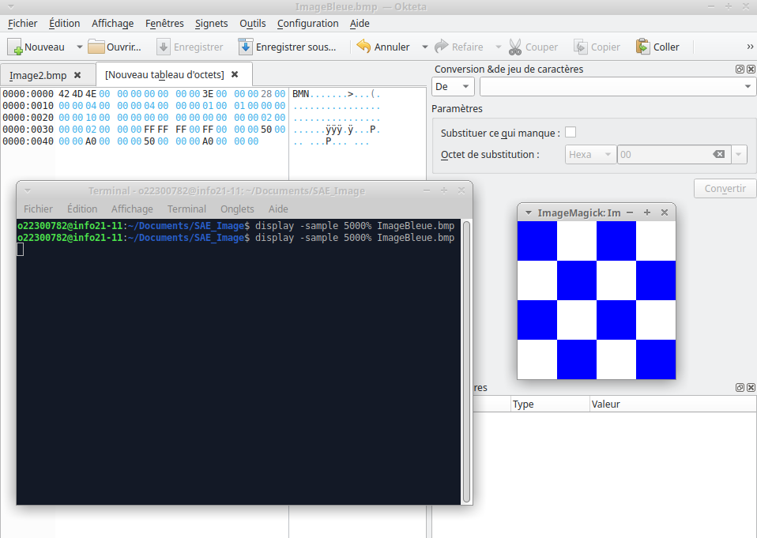

#### 9 ) 
J’ai changé ma palette ainsi que les octets afin d’obtenir l’image correspondante. 

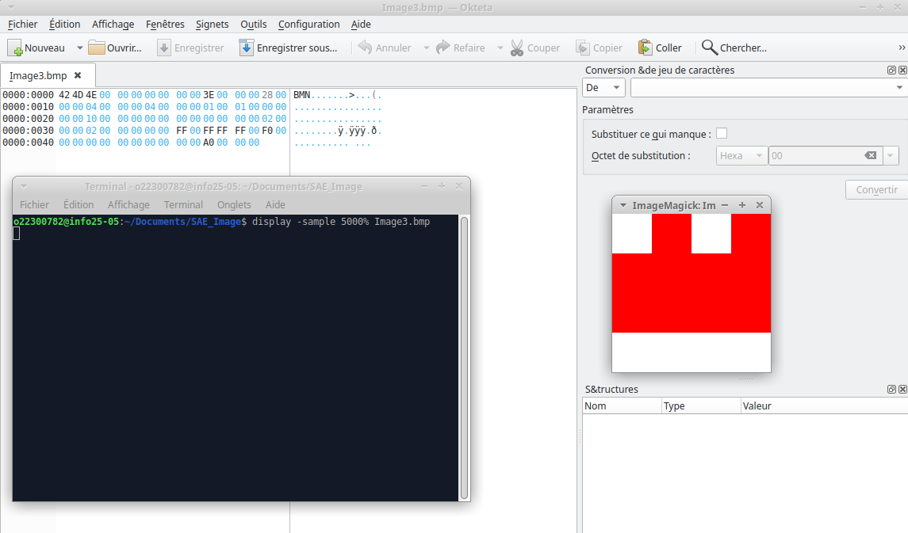

#### 10 ) 

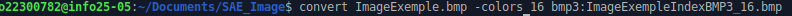

#### 11 ) 
On peut trouver le nombre de couleur à l’adresse 0x2E (ici 10 en hexadécimal soit 16).

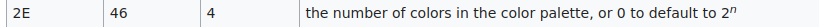

#### 12 ) 
Elle se trouve à l’adresse 0x66 car la couleur se rapproche plus du blanc (FE FE FD en little endian soit FD FE FE).

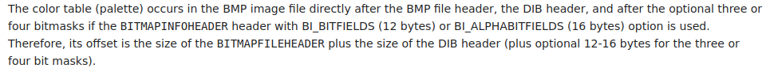

#### 13 ) 
Il commence à l’adresse 0x76.

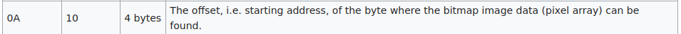

#### 14 )
J’ai d’abord trouvé la couleur bleue à l’adresse 0x6E. C’est la 14ème couleur donc j’ai modifié les prochains pixels de la table de pixels en changeant les « DD » en « EE ». 

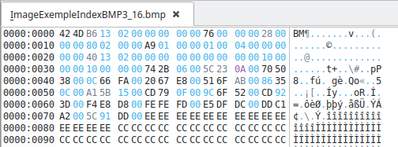

#### 15 ) 
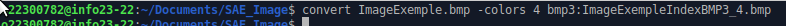

Cela diminue le nombre de couleurs utilisables, par exemple il n’y a plus le orange, il devient gris. En hexadécimal il y a beaucoup moins de possibilités, par exemple les « CC » qui représente le blanc deviennent « 11 ».

### A5 ) 
#### 1 et 2 ) 
Je convertis 4 en -4 à l’adresse 0x16 en C2 donc « 04 00 00 00 » devient « FC FF FF FF ».

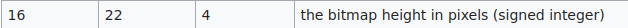
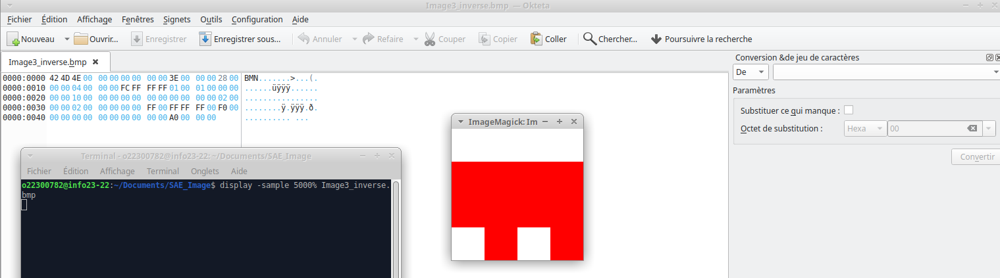

#### 3 )
Je retrouve la hauteur à l’adresse 0x16 qui est A6 01 00 00 en little endian soit 00 00 01 A9 qui vaut 425. Ensuite je calcule -425 en C2 qui est FF FF FE 57 que nous inversons pour remettre en little endian.

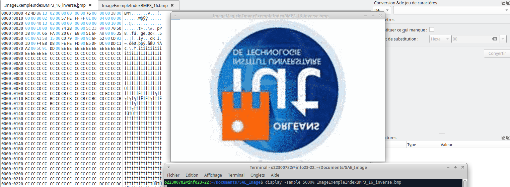

### A6 )
#### 1 )
Le fichier 4 fait 1120 octets car le nombre d’octets a grandement augmenté à cause de nombreux 0 qui dont apparus.

#### 2 ) 
À l’adresse 0x0A nous trouvons l’adresse qui est 36 04 00 00 en little endian soit 00 00 04 36.

#### 3 )
Lorsque nous avons du rouge nous avons 01 00 et pour le blanc 01 01 (et 00 00 pour les retours à la ligne). Le premier octets signifie le nombre de pixels et le deuxième la couleur.

### A7 ) 
#### 1 )
Le fichier 5 fait 1 102 octets. Il est moins lourd que le fichier 5 car il y a des couleurs qui se suivent et cela est donc plus intéressants que le damier du fichier 4.

#### 2 )
Au départ nous avons 04 01 qui signifie 4 pixels blancs,(puis 00 00 pour le retour à la ligne) ensuite 04 00  qui signifie 4 pixels rouges, encore 00 00 puis encore 04 00, puis nous retrouvons du 01 00 pour le rouge et du 01 01 pour le blanc.

### A8 ) 
J’ai modifié les octets à partir de l’adresse 04x36 comme ceci : 

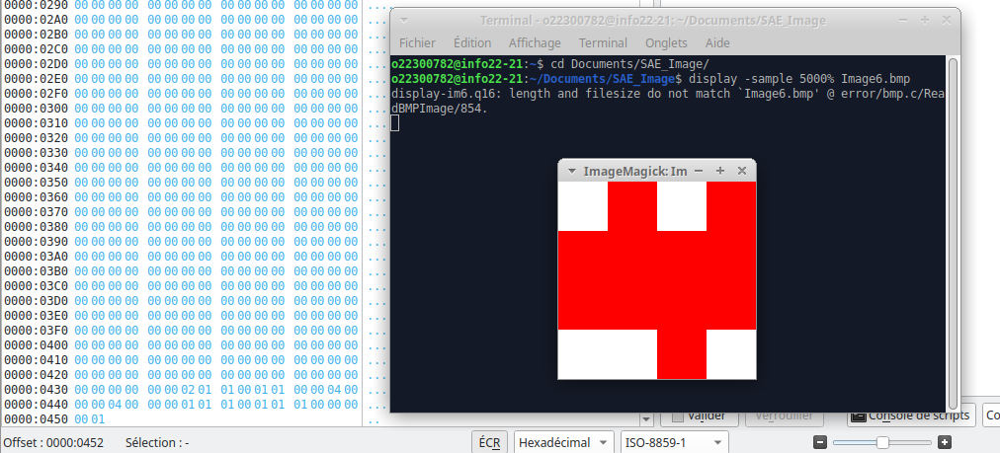

### A9) 
Tout d’abord j’ai ajouté dans ma palette de couleur les couleurs vert et bleu.

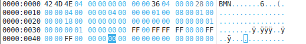

Puis j’ai modifié les octets à partir de l’adresse 04x36 : 

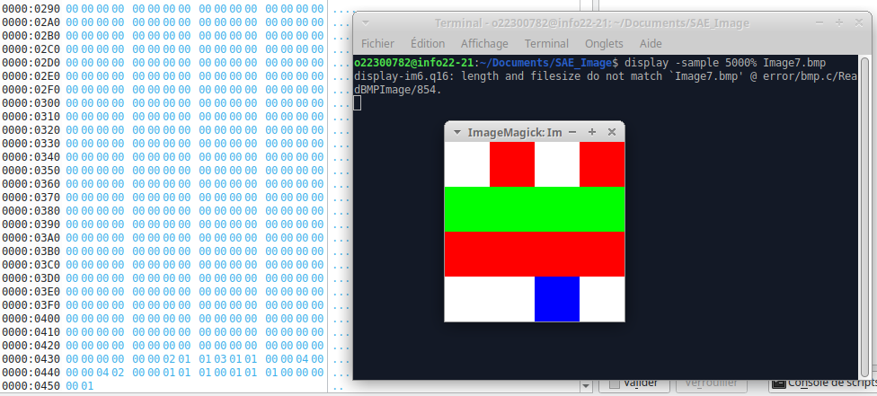

### A10 )
#### 1 ) 
J’ai modifié de nouveau les octets à partir de l’adresse 04x36 :

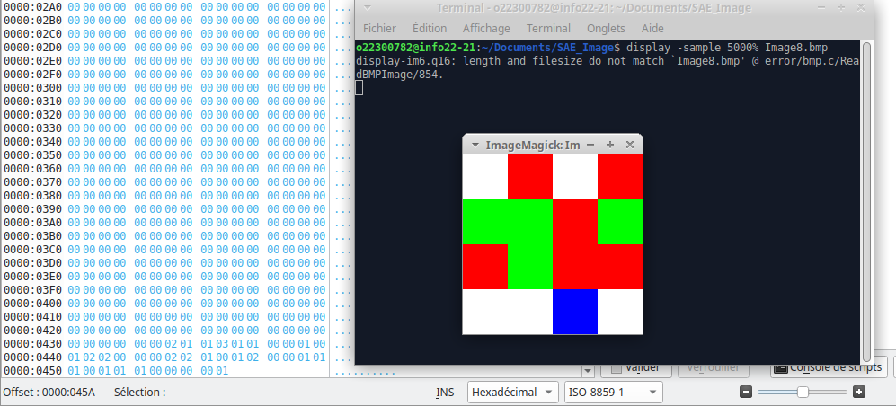

#### 2 )
J’ai modifié à l’adresse 0x0A la position pour laquelle commence le tableau de pixels (ici 36 04 00 00 devient 46 00 00 00 (en little endian)). J’ai modifié aussi à l’adresse 0x2E qui indique le nombre de couleurs (ici 00 01 00 00 devient 04 00 00 00 (en little endian)).

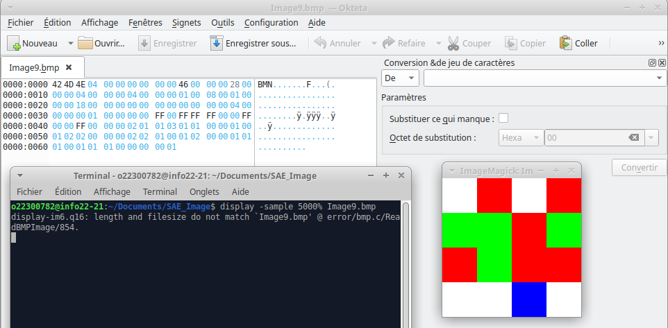

### B1 ) 
J’ai repris le programme donné en base pour parcourir chaque pixel et les récupérer, créé sortie comme dans un autre programme donné. Ensuite j’ai modifier le pixel dans ma sortie en inversant les positions x et y pour tourner l’image de 90 degrés puis finalement j’ai sauvegardé.

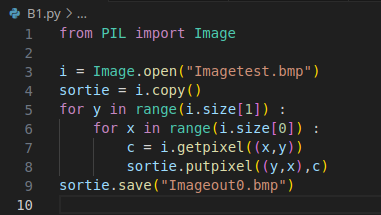

### B2 )
J’ai fait le début comme pour B1 mais forcément sur une autre image (hall-mod_0.bmp) mais j’ai changé x en -x pour provoquer l’effet miroir, et je n’ai pas modifié y.
Je sauvegarde mon fichier modifié ensuite.

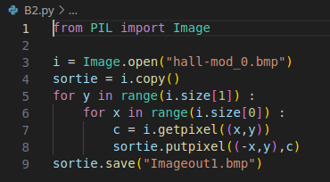

### B3 )
J’ai fait le début pareil que B1 et B2, ensuite avant de changer les pixels j’ai calculé pour le gris grâce à la formule donnée. Ensuite j’ai modifié les pixels en changeant cette fois-ci les couleurs et non la position. J’ai donc laissé x et y mais au lieu de c j’ai mis ce que j’ai calculé dans ma variable gris pour les couleurs (R,V,B).
Je sauvegarde mon fichier modifié ensuite.

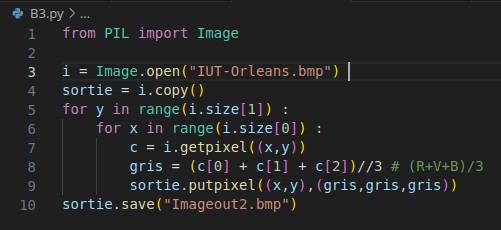

### B4 ) 
Encore une fois j’ai réalisé le début comme pour B1, B2 et B3. J’ai récupérer les 3 couleurs R (rouge),V (vert) et B (bleu) indépendamment qui était dans c. Et ensuite j’ai réalisé une condition pour savoir s’il faut mettre du blanc ou du noir grâce à la formule fournie, si elle est vérifiée je modifie le pixel en le mettant en blanc en gardant les coordonnées x et y et en mettant dans les couleurs 255 pour R, V et B. Sinon, cela veut dire qu’il faut mettre du noir donc je mets toujours les mêmes coordonnées et je mets 0 pour les couleurs R, V et B.
Je sauvegarde mon fichier modifié ensuite.

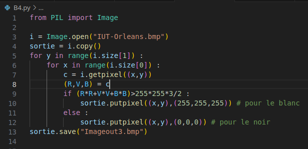

### B5 ) 
