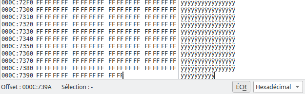

# Rendu SAE image
## GRANDCHAMP Loris

#### A 0 ) 
42 et 4D correspondent respectivement à B et M en ASCII en hexadécimal. Les 4 octets suivants correspondent à la taille du fichier. Ensuite 4 octets de 0. Et ensuite l’adresse où commence le tableau de pixels de l’image (ici 00 00 00 1A).
Pour régler l’erreur j’ai (avec l’aide d’un camarade) regardé la taille du fichier en allant tout en bas du fichier sur Okteta et l’adresse me donnait la taille.

#### A 1 ) 
J’ai créé mon fichier selon les directives mais j’ai cru que le blanc n’était que des 0 sauf que non donc mon image était erronée :

Voici la bonne version après correction :

